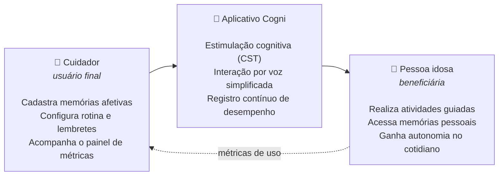
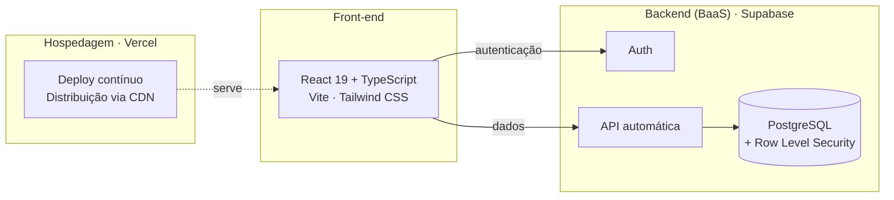

<div align="center">

# 🧠 Cogni

**Ferramenta digital de apoio ao cuidador no cuidado de idosos com doenças neurodegenerativas**

*Estimulação cognitiva, memória afetiva e métricas para quem cuida.*

Trabalho de Conclusão de Curso · Engenharia de Software · Unicesumar Curitiba · 2026


</div>

---

## 📋 Sumário

- [O problema](#-o-problema)
- [A solução](#-a-solução)
- [Base científica](#-base-científica)
- [Funcionalidades](#-funcionalidades)
- [Métricas do painel do cuidador](#-métricas-do-painel-do-cuidador)
- [Jogos cognitivos](#-jogos-cognitivos)
- [Mercado e diferenciais](#-mercado-e-diferenciais)
- [Arquitetura e tecnologias](#-arquitetura-e-tecnologias)
- [Estado atual do projeto](#-estado-atual-do-projeto)
- [Cronograma](#-cronograma)
- [Como executar](#-como-executar)
- [Estrutura do projeto](#-estrutura-do-projeto)
- [Design e acessibilidade](#-design-e-acessibilidade)
- [Equipe](#-equipe)
- [Referências](#-referências)

---

## 🔎 O problema

O envelhecimento da população brasileira traz um aumento contínuo dos casos de demência.

| Dado | Contexto |
| --- | --- |
| **1,8 milhão** | de brasileiros com 60 anos ou mais vivem hoje com algum tipo de demência |
| **5,5 milhões** | é a projeção para 2050, passando por 2,8 milhões já em 2030 |
| **+80%** | dos casos de demência no Brasil permanecem sem diagnóstico |
| **16,6%** | da população brasileira é idosa (cerca de 35 milhões de pessoas) |

<sub>Fontes: IBGE (PNAD Contínua, 2025); ABRAZ (2025).</sub>

Essa realidade atinge **duas pessoas ao mesmo tempo**:

- **A pessoa idosa:** o avanço de doenças neurodegenerativas, como o Alzheimer, traz perda de memória, dificuldade para reconhecer pessoas e lugares e redução da autonomia no dia a dia.
- **O cuidador familiar:** cuidar de alguém com demência gera sobrecarga emocional, física e financeira. É difícil acompanhar, monitorar e ajustar o cuidado de forma contínua.

### A lacuna

As soluções existentes tendem a **apenas informar ou monitorar**. Faltam ferramentas que apoiem o cuidador com metodologia validada e com **dados que ajudem a decidir** o que fazer no cuidado diário. Uma revisão sistemática publicada na *JMIR Aging* (2024) aponta que os aplicativos de cuidado de demência carecem de informação de qualidade e adaptada às necessidades reais do cuidador.

---

## 💡 A solução

O **Cogni** coloca **o cuidador no centro do cuidado**. Ele é o usuário final do sistema, e a pessoa idosa é a beneficiária.



**Ciclo de valor:** as métricas geradas pelo uso da pessoa idosa voltam ao cuidador em forma de painel. O resultado é um ciclo de **acompanhamento e decisão**, e não apenas de entretenimento cognitivo.

---

## 📚 Base científica

Cada funcionalidade se apoia em evidências publicadas:

| Área | Evidência | Fonte |
| --- | --- | --- |
| **Estimulação cognitiva** | Cerca de **6 meses de atraso** no declínio esperado em demência leve a moderada. Sessões duas vezes por semana tendem a render mais. | Cochrane, Woods et al. (2023) |
| **Memória afetiva** | Benefícios pequenos, porém consistentes, em qualidade de vida, cognição, comunicação e humor. | Cochrane, Woods et al. (2018) |
| **Monitoramento** | Registro, autoavaliação e alertas ativam a autorregulação do cuidador e **reduzem a sobrecarga**. | Revisão sistemática, Deliu (2026) |

---

## ✨ Funcionalidades

A funcionalidade central é o **painel de métricas do cuidador**, que reúne desempenho cognitivo, engajamento, adesão à rotina e alertas em um só lugar. Ao redor dele estão as funcionalidades abaixo.

| # | Funcionalidade | Descrição | Status |
| :-: | --- | --- | :-: |
| ⭐ | **Painel de métricas** | Indicadores, tendências e alertas de cada pessoa acompanhada | 🟢 Interface pronta |
| 1 | **Jogos de memória** | Atividades com imagens, palavras e sons, alinhadas à Terapia de Estimulação Cognitiva (CST) | 🟢 Interface pronta |
| 2 | **Memória afetiva** | Fotos e histórias de pessoas importantes | 🟡 Planejado |
| 3 | **Lugares familiares** | Fotos e informações de locais conhecidos | 🟡 Planejado |
| 4 | **Comandos por voz** | Menos navegação por menus para a pessoa idosa | 🟡 Planejado |
| 5 | **Rotina e lembretes** | Atividades, compromissos e horários | 🟡 Planejado |
| 6 | **Dificuldade adaptativa** | Nível ajustado ao desempenho do usuário | 🟠 Parcial (seleção manual de nível) |
| 7 | **Mensagens afetivas** | Estímulos de familiares durante o uso | 🟡 Planejado |
| 8 | **Relatórios exportáveis** | Métricas para compartilhar com especialistas | 🟠 Parcial (tela pronta, exportação pendente) |

<sub>🟢 interface implementada · 🟠 parcialmente implementada · 🟡 prevista nas próximas etapas</sub>

### Telas já implementadas

- **Login** do cuidador com validação de campos.
- **Painel inicial** com número de pessoas acompanhadas, sessões do dia, alertas críticos, tendência de cada pessoa e sessões recentes.
- **Lista e perfil** de cada pessoa acompanhada, com diagnóstico, observações, histórico e **gráfico radar** dos cinco domínios cognitivos (memória, atenção, linguagem, função executiva e habilidade visuoespacial).
- **Catálogo de jogos** com quatro atividades jogáveis, escolha de nível e registro de observações ao final de cada sessão.
- **Relatórios** por pessoa e por período (semana, mês ou 3 meses), com índice geral, duração média e desempenho por domínio.
- **Insights**: cartões de alerta, melhora, recomendação e tendência, além de um assistente em formato de conversa. Nesta etapa, a tela é uma **exploração de interface** com respostas pré-definidas.

---

## 📊 Métricas do painel do cuidador

| Cognitivas | Engajamento | Rotina | Alertas |
| --- | --- | --- | --- |
| Acertos e erros por atividade | Frequência e duração de uso | Adesão a lembretes | Configuráveis pelo cuidador |
| Tempo de resposta | Atividades preferidas | Compromissos cumpridos | Sinalizam desvios relevantes |
| Tendência ao longo do tempo | Picos e quedas | Horários difíceis | Apoiam, mas não diagnosticam |

> As métricas podem ser exportadas para especialistas e **não substituem avaliação clínica**.

---

## 🧩 Jogos cognitivos

| Jogo | Domínio estimulado | Como funciona | Níveis |
| --- | --- | --- | --- |
| **Velocidade de Atenção** | Atenção e tempo de reação | Uma estrela aparece em uma grade e deve ser tocada o mais rápido possível. A cada acerto ela muda de lugar e o ritmo aumenta. | Grade 3×3 (30 s, lento) → 3×3 (25 s, médio) → 4×4 (20 s, acelerado) |
| **Associação de Pares** | Memória de trabalho | Jogo da memória: virar duas cartas por vez e encontrar os pares iguais. | 4, 5 ou 6 pares |
| **Categorias** | Linguagem semântica | Uma categoria é exibida e é preciso tocar em todas as palavras que pertencem a ela, evitando os distratores, antes que o tempo acabe. | Frutas (30 s) → Animais (25 s) → Objetos de cozinha (20 s) |
| **Associação de Imagens** | Memória visual | Associar cada imagem à palavra correspondente. | 3 níveis |

A pontuação vai de **0 a 100%** e considera acertos, erros e tentativas. O resultado usa mensagens encorajadoras ("Excelente!", "Muito bem!", "Continue tentando!"), sem caráter punitivo. Jogos de **reconhecimento de sons** estão previstos.

---

## 🌎 Mercado e diferenciais

O mercado é **fragmentado no exterior e embrionário no Brasil**.

| No exterior: maduro, mas uma dor por app | No Brasil: acadêmico ou em fase inicial |
| --- | --- |
| **Lumosity:** treino cognitivo geral | **MemoryLife (UFPA):** validado clinicamente, sem produto escalado |
| **GreyMatters:** terapia de reminiscência | **Recordar (IFCE):** projeto de hackathon |
| **CareZone:** gestão de medicação e sintomas | **Cérebro Ativo:** tração comercial, mas só jogos cognitivos |
| **Timeless:** reconhecimento facial com IA | **Humanis:** ainda em captação de investimento |

<sub>Fontes: Crippa (2023); IFCE (2022); Sebrae (2023); FEBRAZ (2024).</sub>

### Não é mais um app de jogos de memória

- ✅ **Cuidador como usuário final**, e não como coadjuvante.
- ✅ **Funcionalidades ancoradas em revisões Cochrane.**
- ✅ **Métricas que levam à ação**, e não apenas monitoramento passivo.

---

## 🏗 Arquitetura e tecnologias

O Cogni usa uma stack enxuta, pensada para dados de saúde.



| Camada | Tecnologias | Papel |
| --- | --- | --- |
| **Front-end** | React 19, TypeScript, Vite, Tailwind CSS 4 | Interface do cuidador e das atividades |
| **Backend (BaaS)** | Supabase: PostgreSQL gerenciado, autenticação e API gerada automaticamente | Persistência, login, cadastros e dados para os relatórios |
| **Hospedagem** | Vercel | Deploy contínuo e distribuição via CDN |

### 🔒 LGPD desde o início

Por lidar com **dados sensíveis de saúde**, o projeto usa **Row Level Security (RLS)** do PostgreSQL e a autenticação nativa do Supabase. Assim, cada cuidador enxerga **apenas as pessoas que acompanha**.

---

## 🚧 Estado atual do projeto

O Cogni **não é apenas um front-end**. O desenvolvimento segue o cronograma da disciplina e está dividido em etapas.

**Etapa concluída: implementação das telas.** Nesta fase foi construída a interface navegável em React. Para validar fluxos e navegabilidade antes do banco de dados, as telas usam **dados de demonstração** (`src/data.ts`), com tipos TypeScript que já servem de base para o modelo de dados:

- `Patient`: pessoa acompanhada, com diagnóstico, histórico e métricas;
- `Session`: sessão de jogo, com data, jogo, duração, pontuação e nível;
- `CognitiveMetrics`: pontuação de 0 a 100 nos cinco domínios cognitivos;
- `AIInsight`: alertas, recomendações e tendências.

**Próximas etapas:** banco de dados no Supabase, autenticação real (login, cadastro e recuperação de senha), relatórios com dados reais, cadastros básicos e deploy na Vercel. Veja o [cronograma](#-cronograma).

---

## 🗓 Cronograma

Cronograma da disciplina **ESOFT6 – TCC1**:

| Semana | Datas | Etapa | Status |
| :-: | --- | --- | :-: |
| 1 | 04–05/ago | Orientação das equipes | ✅ |
| 2 | 11–12/ago | Entrega do cronograma | ✅ |
| 3 | 18–19/ago | Entrega do tema, integrantes, objetivo e justificativa | ✅ |
| 4 | 25–26/ago | Pesquisa bibliográfica e pesquisa de mercado | ✅ |
| 5 | 01–02/set | Lista de requisitos funcionais | ✅ |
| 6 | 09/set | Definição das tecnologias do projeto | ✅ |
| 7 | 15–16/set | Protótipo de telas e navegabilidade | ✅ |
| 8 | 22–23/set | 🎤 Defesa do projeto: apresentação das equipes | ✅ |
| 9 | 29–30/set | **Implementação das telas** | ✅ |
| 10 | 06–07/out | Implementação do banco, prevendo suporte à gestão | ⏳ |
| 11 | 13–14/out | 🎤 Apresentação: login, cadastro de usuários e "esqueci minha senha" | ⏳ |
| 12 | 20–21/out | Suporte à gestão: relatórios, resultados e justificativas | ⏳ |
| 13 | 27–28/out | Correções e preparação dos fluxos de processo para os cadastros básicos | ⏳ |
| 14 | 03–04/nov | Implementação dos cadastros básicos | ⏳ |
| 15 | 10–11/nov | 🎤 Apresentação: processos do sistema e funcionalidades básicas | ⏳ |
| 16 | 17–18/nov | Correções e preparação do documento do TCC1 | ⏳ |
| 17 | 24–25/nov | 🎤 Defesa do projeto: apresentação das equipes | ⏳ |
| 18 | 01–02/dez | Correções e entrega do documento e do código | ⏳ |
| 19 | 08–09/dez | Reapresentação, caso necessário | ⏳ |

<sub>✅ concluído · ⏳ a fazer · 🎤 apresentação</sub>

Após o TCC1, está prevista a **validação com cuidadores e/ou especialistas**. Como referência de usabilidade, o protótipo MEMO obteve 87,3 pontos na escala SUS (System Usability Scale).

---

## 🚀 Como executar

### Pré-requisitos

- [Node.js](https://nodejs.org/) 22
- [pnpm](https://pnpm.io/) 10

> Se você usa o [mise](https://mise.jdx.dev/), as versões corretas já estão definidas no arquivo `.mise.toml`. Basta rodar `mise install`.

### Passo a passo

```bash
# 1. Clone o repositório
git clone https://github.com/MylenaLuz/cogni.git
cd cogni

# 2. Instale as dependências
pnpm install

# 3. Inicie o servidor de desenvolvimento
pnpm dev
```

A aplicação fica disponível em **http://localhost:8443**. Para usar outra porta, defina a variável `PORT` (ex.: `PORT=3000 pnpm dev`).

### Credenciais de teste

| Campo | Valor |
| --- | --- |
| E-mail | `cuidador@cogni.app` |
| Senha | `cogni123` |

### Scripts disponíveis

| Comando | Descrição |
| --- | --- |
| `pnpm dev` | Inicia o servidor de desenvolvimento |
| `pnpm build` | Gera a versão de produção na pasta `dist/` |
| `pnpm preview` | Visualiza localmente a versão de produção |
| `pnpm format` | Formata os arquivos do projeto |

---

## 📁 Estrutura do projeto

```text
cogni/
├── index.html
├── package.json
├── vite.config.ts
├── tsconfig.json
├── .mise.toml                 # Versões de Node.js e pnpm
└── src/
    ├── main.tsx               # Ponto de entrada da aplicação
    ├── App.tsx                # Controle de navegação entre telas
    ├── data.ts                # Tipos e dados de demonstração
    ├── index.css              # Tema (cores e fonte) e animações
    ├── components/
    │   ├── NavBar.tsx         # Barra de navegação inferior
    │   ├── GameHeader.tsx     # Cabeçalho usado durante os jogos
    │   └── GameResult.tsx     # Tela de resultado dos jogos
    └── screens/
        ├── Login.tsx
        ├── Dashboard.tsx      # Painel de métricas do cuidador
        ├── Patients.tsx       # Pessoas acompanhadas
        ├── PatientDetail.tsx  # Perfil e gráfico radar
        ├── Games.tsx          # Catálogo de jogos
        ├── GameSession.tsx    # Jogo: Associação de Imagens
        ├── Reports.tsx        # Relatórios de desempenho
        ├── AIInsights.tsx     # Insights e assistente
        └── games/
            ├── AttentionSpeed.tsx  # Jogo: Velocidade de Atenção
            ├── MemoryPairs.tsx     # Jogo: Associação de Pares
            └── Categories.tsx      # Jogo: Categorias
```

A navegação é controlada pelo `App.tsx`, que guarda a tela atual e a pessoa selecionada em estado do React e repassa uma função `navigate` para as telas. As cores e a fonte ficam no bloco `@theme` do Tailwind, em `src/index.css`.

---

## 🎨 Design e acessibilidade

O visual foi pensado para ser **acolhedor sem ser infantilizado**, com respeito ao público adulto e idoso.

| Elemento | Decisão |
| --- | --- |
| **Cor primária** | Azul-petróleo `#2C7A7A`: transmite calma e confiança sem parecer hospitalar |
| **Fundo** | Tom areia `#F7F2E9`, evitando o excesso de branco puro |
| **Destaque** | Verde-menta `#52B788` para progresso e acertos |
| **Erro** | Vermelho suave `#D96B6B`, usado de forma não punitiva |
| **Tipografia** | [Nunito](https://fonts.google.com/specimen/Nunito), uma sans-serif humanista e legível |

Outras diretrizes seguidas:

- Contraste alto entre texto e fundo.
- Ícones sempre acompanhados de texto.
- Áreas de toque grandes e poucos elementos por tela.
- Feedback imediato e não punitivo de acerto e erro.
- Layout pensado primeiro para dispositivos móveis.

---

## 👥 Equipe

| Integrante |
| --- |
| Kimberly Valle |
| Lucas Matheus Vaz |
| Mylena Alves |

**Curso:** Engenharia de Software · **Instituição:** Unicesumar, Curitiba · **Ano:** 2026

---

## 📖 Referências

As referências completas estão no documento do TCC.

- ABRAZ – Associação Brasileira de Alzheimer (2025).
- Crippa (2023).
- Deliu (2026). Revisão sistemática sobre monitoramento e autorregulação do cuidador.
- FEBRAZ – Federação Brasileira das Associações de Alzheimer (2024).
- IBGE. Pesquisa Nacional por Amostra de Domicílios Contínua – PNAD Contínua (2025).
- IFCE (2022).
- JMIR Aging (2024). Revisão sistemática sobre aplicativos de cuidado de demência.
- Sebrae (2023).
- Woods, B. et al. (2018). *Reminiscence therapy for dementia*. Cochrane Database of Systematic Reviews.
- Woods, B. et al. (2023). *Cognitive stimulation to improve cognitive functioning in people with dementia*. Cochrane Database of Systematic Reviews.

---

<div align="center">

⚠️ O Cogni é um projeto acadêmico. As métricas e alertas **apoiam o cuidado, mas não substituem avaliação, diagnóstico ou acompanhamento feitos por profissionais de saúde**.

</div>
